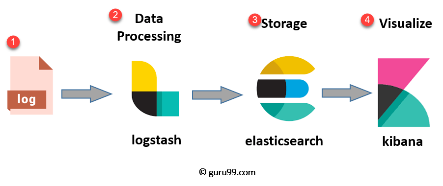
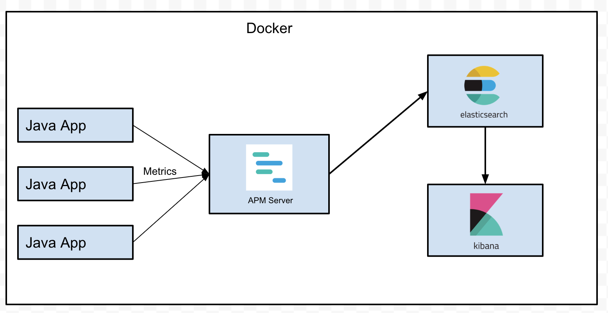

# Number Convertor - Integer to Roman Numerals

>Developer: Sathish Raghu

This application is used to convert integer into Roman Numerals. Technologies used in this project are

* **Java**
* **SpringBoot** 
* **Junit**
* **Powermock**
* **Swagger**
* **Docker/Docker-compose**
* **Elastic Search**
* **LogStash**
* **Kibana**


**Prerequisites:**

* [Java 8](https://adoptopenjdk.net/)
* [Maven 3](https://maven.apache.org/download.cgi)
* [Docker](https://www.docker.com/products/docker-desktop)

## Architecture

**Logs Flow**





**Metrics Flow**


## Build & Installation Instructions

To install and validate the application please follow the instructions below

1. Git Clone
```
git clone https://github.com/rsathish29/NumberConvertor.git
```
2. Pre-requisites Java, Maven & Docker are installed in the system
   

3. Perform Maven Build to generate the maven artifact JAR File
```
mvn clean install   
```
4. After the build is successful, cd into the docker folder
```
cd docker
```
5. Create the docker containers for ELK Stack using docker compose command
```
docker-compose -f docker-compose.yml up  -d
```
6. Verify if the containers for the ELK Stack is running. 3 Containers[Elastic Search, Logstash, Kibana] should be running.
````
docker-compose -f docker-compose.yml ps
````
7. Repeat step#6 until the elasticsearch container is healthy(since it takes time to bootup ~1minute)


8. Create the docker containers for SpringBoot application along with APM server
````
docker-compose -f docker-compose-springboot.yml up  -d
````
9. Verify if the containers are running for the springboot application & apm server.
````
docker-compose -f docker-compose-springboot.yml ps
````
10. Verify the health of the spring boot application using the browser(Credentials required)
````
http://localhost:8080/actuator/health
````
11. Spring security is enabled for the application [userId:welcome, password:Hello@123]


12.Verify if Kibana endpoint is accessible for Logging, Metrics & Monitoring
````
http://localhost:5601
````

## Testing Instructions

This application is a spring boot rest application that exposes rest API for numeric to Roman Numeral conversion

After everything starts, you can enter the url in the browser :
>http://localhost:8080/romannumeral?query=35

**Test Scenarios to validate the API**
```
GET /romannumeral?query= ~> {"result":null,"error":{"code":100,"description":"Input cannot be empty"}} [400]
GET /romannumeral?query=a ~> {"result":null,"error":{"code":101,"description":"Invalid Input data, expected input is Integer. Range 1-3999"}} [400]
GET /romannumeral?query=5 ~> {"result":"V","error":null} [200 OK]
GET /romannumeral?query=18 ~> {"result":"XVIII","error":null} [200 OK]
GET /romannumeral?query=18908 ~> {"result":null,"error":{"code":101,"description":"Invalid Input data, expected input is Integer. Range 1-3999"}} [400]
```
**Junit Test condition written**
```
Intellij/Eclipse IDE :

Run ->  ConversionControllerTest
        - testConvertIntegerToRomanNumeral_Success  (Positive Scenario)
        - testConvertIntegerToRomanNumeral_Failure (Negative Scenario -> Invalid input)
        
Run ->  RomanConversionServiceTest
        - testIntegerToRomanNumeral  (Positive Scenario, since all the negative scenarios will be handled in controller layer)

Run ->  ConversionValidatorTest
        - testParseInt_EmptyString  (Negative Scenario -> empty input)
        - testParseInt_InvalidCharacter (Negative Scenario -> non numeric)
        - testParseInt_InputOutOfRange (Negative Scenario -> number out of range)
        - testParseInt_SuccessScenario(Positive Scenario)

```

**Integration Test condition written**
```
Intellij/Eclipse IDE :

Run ->  ConversionIntegrationTest
        - testconvertIntegerToRomanNumeral_EmptyInput  (Negative Scenario -> empty input)
        - testconvertIntegerToRomanNumeral_InvalidInput (Negative Scenario -> non numeric)
        - testconvertIntegerToRomanNumeral_InputOutOfRange (Negative Scenario -> number out of range)
        - testconvertIntegerToRomanNumeral_Success(Positive Scenario)

```

## DevOps - Metrics, Monitoring & Logging


## ShutDown Containers Instructions

**Stop & Delete the containers**

````
docker-compose -f docker-compose-elk.yml down
docker-compose -f docker-compose-springboot.yml down
docker system prune
````

**verify containers are stopped and deleted**

```
docker-compose -f docker-compose-elk.yml ps
docker-compose -f docker-compose-springboot.yml ps
```

## References

* [Spring Boot Documentation](https://docs.spring.io/spring-boot/docs/current/reference/htmlsingle/)
* [Docker Documentation](https://docs.docker.com/)
* [Docker compose Documentation](https://docs.docker.com/compose/)  
* [Logstash Documentation](https://www.elastic.co/guide/en/logstash/6.8/index.html)
* [ElasticSearch Documentation](https://www.elastic.co/guide/en/elasticsearch/reference/6.8/index.html)
* [Kibana Documentation](https://www.elastic.co/guide/en/kibana/6.8/index.html)
* [Swagger UI](https://swagger.io/tools/swagger-ui/)

**TIP:** You can use [Docker Desktop Mac](https://docs.docker.com/docker-for-mac/) or [Docker Desktop Windows](https://docs.docker.com/docker-for-windows/) to run application

