# Number Convertor - Integer to Roman Numerals

>Developer: Sathish Raghu

This application is used to convert integer into Roman Numerals. Technologies used in this project are

* **Java**
* **Spring** 
* **SpringBoot** 
* **Junit**
* **Powermock**
* **Swagger**
* **Docker/Docker-compose**
* **Elastic Search**
* **LogStash**
* **Kibana**
* **Prometheus**
* **Grafana**

**Prerequisites:**

* [Java 8](https://adoptopenjdk.net/)
* [Maven 3](https://maven.apache.org/download.cgi)
* [Docker](https://www.docker.com/products/docker-desktop)
* [Docker-Compose](https://docs.docker.com/compose/install/)
* The following ports[8200, 9200, 9300, 3000, 5601, 5000, 9600, 9090,8080] should NOT be used since it will be used by various containers of this demo application 

## Architecture

**Logs Flow**

1. Application logs are sent to the logstash pipeline via TCP Connection
2. These logs are then sent to ElasticSearch with the configured index - logstash*
3. Kibana is used to visualize the logs by connecting to elasticsearch
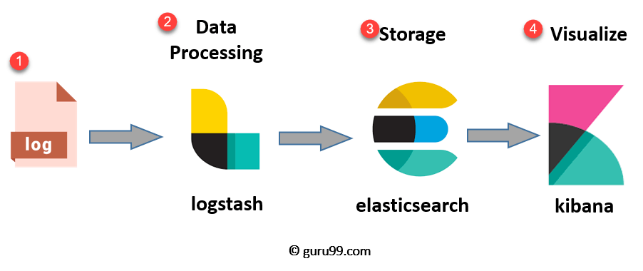


**APM Metrics Flow**

1. Elastic APM Agent is installed along with the spring boot application
2. APM Server is also installed to capture the metrics from the apm agents
3. APM Server then connects to elastic search to store all the metrics.
4. Kibana is again used to visualize all the metrics.
5. The APM Server and the springboot applications are created using docker compose.
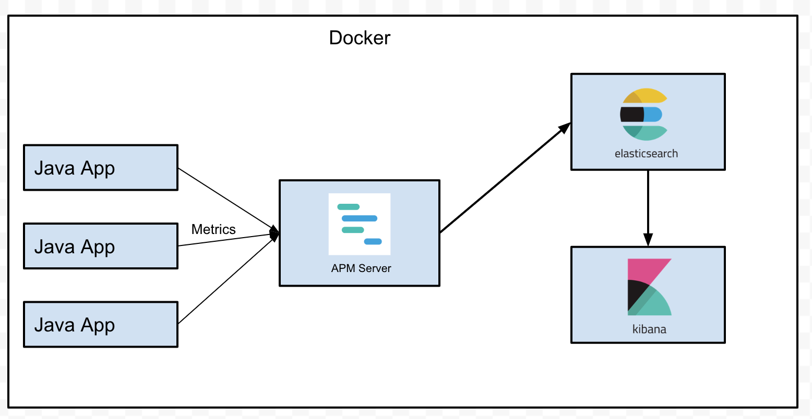

**JVM Metrics Flow**

1. Spring Boot application exposes /actuator/prometheus endpoint for exposing various JVM Metrics
2. Prometheus scrapes the metrics from the application based on the configured frequency
3. Grafana, the visualization platform is used to display all the metrics using different dashboards.
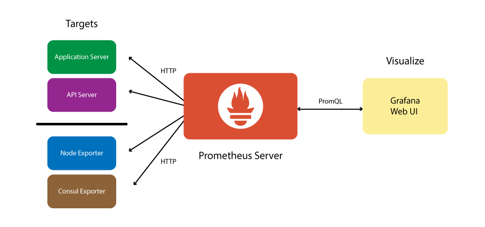


## Build & Installation Instructions

To install and validate the application please follow the instructions below

1. Git Clone
```
git clone https://github.com/rsathish29/NumberConvertor.git

cd NumberConvertor
```
2. Pre-requisites Java, Maven, Docker & Docker-Compose are installed in the system
````
java -version
mvn -v
docker version
docker-compose version
```` 

3. Perform Maven Build to generate the maven artifact JAR File
```
mvn clean install   
```
4. After the build is successful, cd into the docker folder
```
cd docker
```
5. Create the docker containers for ELK Stack using docker compose command
```
docker-compose -f docker-compose.yml up  -d --build
```
6. Verify if the containers for the ELK Stack is running. 7 Containers[Elastic Search, Logstash, Kibana,APM Server, SpringBootApp, Prometheus, Grafana ] should be running.
````
docker-compose -f docker-compose.yml ps

                Name                              Command                  State                                Ports
-----------------------------------------------------------------------------------------------------------------------------------------------
spring_boot_elk_demo_apm_1             /usr/local/bin/docker-entr ...   Up             0.0.0.0:8200->8200/tcp
spring_boot_elk_demo_elasticsearch_1   /usr/local/bin/docker-entr ...   Up (healthy)   0.0.0.0:9200->9200/tcp, 0.0.0.0:9300->9300/tcp
spring_boot_elk_demo_grafana_1         /run.sh                          Up             0.0.0.0:3000->3000/tcp
spring_boot_elk_demo_kibana_1          /usr/local/bin/kibana-docker     Up             0.0.0.0:5601->5601/tcp
spring_boot_elk_demo_logstash_1        /usr/local/bin/docker-entr ...   Up             0.0.0.0:5000->5000/tcp, 5044/tcp, 0.0.0.0:9600->9600/tcp
spring_boot_elk_demo_prometheus_1      /bin/prometheus --config.f ...   Up             0.0.0.0:9090->9090/tcp
spring_boot_elk_demo_springbootapp_1   /bin/sh -c java -javaagent ...   Up             0.0.0.0:8080->8080/tcp
````
7. Repeat step#6 until the all containers are UP & elasticSearch is healthy(since it takes time to bootup ~1minute)


8. Spring security is enabled for the spring boot application [userId:welcome, password:Hello@123]


9. Verify the health of the spring boot application using the browser[Use the credentials provided in step#8]

>http://localhost:8080/actuator/health
````
{"status":"UP"}
````
10. Verify if Kibana endpoint is accessible.

>http://localhost:5601

11. Verify if Swagger is up and running(Use Credentials from Step#8 if prompted)

>http://localhost:8080/swagger-ui.html

12. Verify if Grafana endpoint is accessible.(User: admin, Password: Hello@123)

>http://localhost:3000


## Testing Instructions

This application is a spring boot rest application that exposes rest API for numeric to Roman Numeral conversion

After everything starts, you can enter the url in the browser :
>http://localhost:8080/romannumeral?query=35

**Test Scenarios to validate the API**
```
GET /romannumeral?query= ~> {"error":{"code":100,"description":"Input cannot be empty"}} [400]
GET /romannumeral?query=a ~> {"error":{"code":101,"description":"Invalid Input data, expected input is Integer. Range 1-3999"}} [400]
GET /romannumeral?query=5 ~> {"result":"V"} [200 OK]
GET /romannumeral?query=18 ~> {"result":"XVIII"} [200 OK]
GET /romannumeral?query=18908 ~> {"error":{"code":101,"description":"Invalid Input data, expected input is Integer. Range 1-3999"}} [400]
```
**Junit Test condition written**
```
Intellij/Eclipse IDE :

Run ->  ConversionControllerTest
        - testConvertIntegerToRomanNumeral_Success  (Positive Scenario)
        - testConvertIntegerToRomanNumeral_Failure (Negative Scenario -> Invalid input)
        
Run ->  RomanConversionServiceTest
        - testIntegerToRomanNumeral  (Positive Scenario, since all the negative scenarios will be handled in controller layer)

Run ->  ConversionValidatorTest
        - testParseInt_EmptyString  (Negative Scenario -> empty input)
        - testParseInt_InvalidCharacter (Negative Scenario -> non numeric)
        - testParseInt_InputOutOfRange (Negative Scenario -> number out of range)
        - testParseInt_SuccessScenario(Positive Scenario)

```

**Integration Test condition written**
```
Intellij/Eclipse IDE :

Run ->  ConversionIntegrationTest
        - testconvertIntegerToRomanNumeral_EmptyInput  (Negative Scenario -> empty input)
        - testconvertIntegerToRomanNumeral_InvalidInput (Negative Scenario -> non numeric)
        - testconvertIntegerToRomanNumeral_InputOutOfRange (Negative Scenario -> number out of range)
        - testconvertIntegerToRomanNumeral_Success(Positive Scenario)

```

**Additional Springboot Actuator Metrics Monitoring Endpoints**
````
http://localhost:8080/actuator
http://localhost:8080/actuator/health
http://localhost:8080/actuator/loggers
http://localhost:8080/actuator/heapdump
http://localhost:8080/actuator/threaddump
http://localhost:8080/actuator/prometheus
http://localhost:8080/actuator/metrics
http://localhost:8080/actuator/metrics/{requiredMetricName}
````

## DevOps - Metrics, Monitoring & Logging

**Steps to Check the application logs**

1. Open the following Kibana link in browser

>http://localhost:5601

2. In order to view the application logs, index pattern has to be created.


3. Configure Index pattern using this link
>http://localhost:5601/app/kibana#/management/kibana/index
   

4. Key in the index pattern as logstash* [make sure the asterisk is added to the end]and click Next Step


5. Select any option in the dropdown and click the create index pattern.


6. Refer the screenshot below for the index creation.
   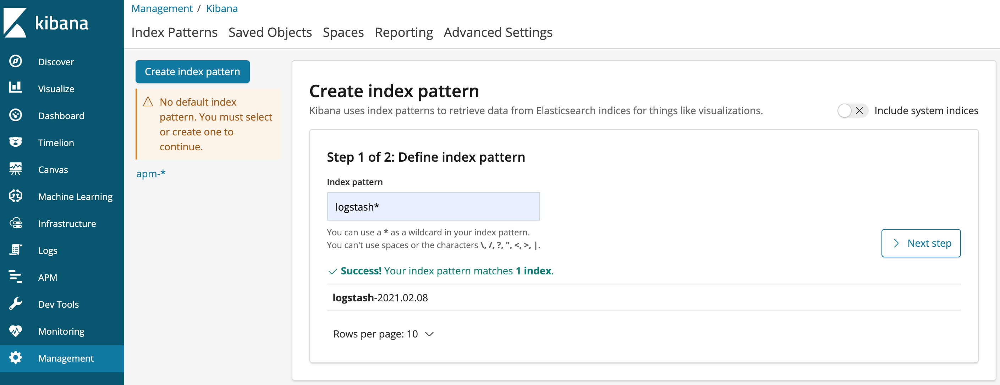


7. Once index is created, select Discover option
   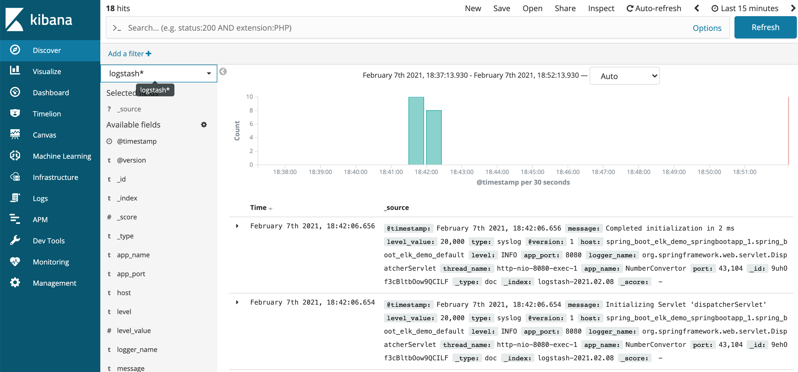

8. By default, the apm-* index pattern might be selected. Please change it to logstash* pattern.


9. After making this change, the application logs should be displayed on this page. Change Time range to last 15 minutes.


**Steps to Monitor Metrics of application**

1. Open the APM Metrics of the application in Kibana using the link
>http://localhost:5601/app/apm

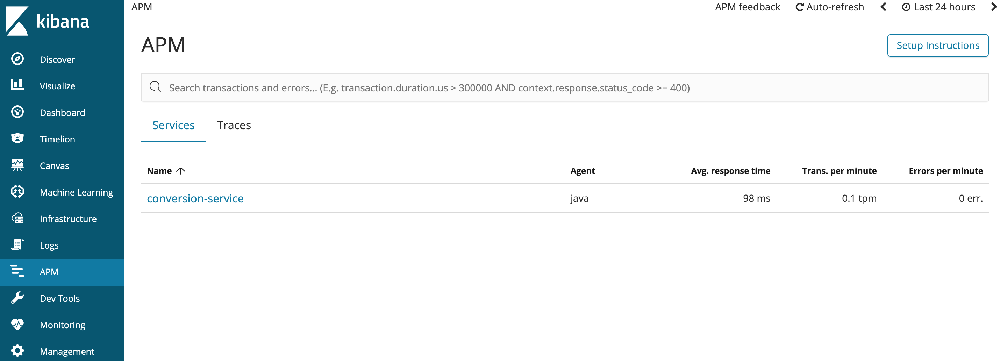

2. Click on the Conversion-Service to view the application APM Metrics

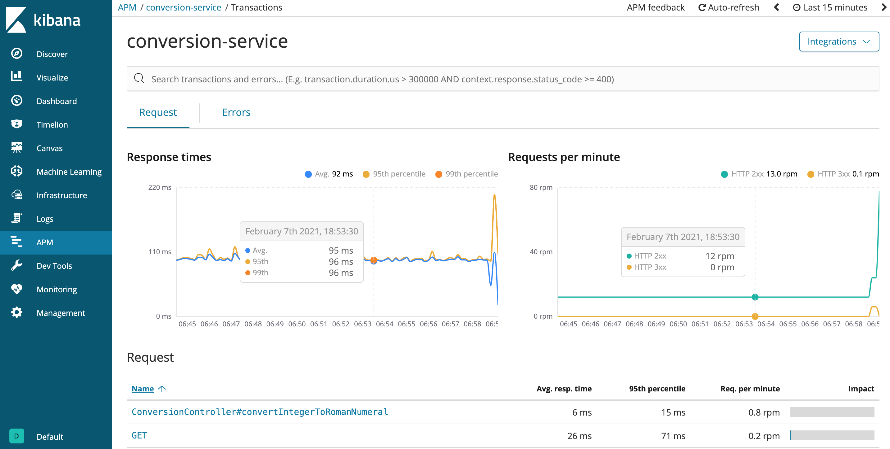

3. Change the time window[top right] to last 15 minutes (or) 30 minutes to see the graphs

**Steps to Monitor JVM Metrics of application**

1. Open the Grafana Visualization Tool 
>http://localhost:3000/

2. Login Credentials
````
username : admin
password : Hello@123
````

3. After successful login, you should be seeing the home page as given below. 


4. JVM Dashboard is already preconfigured that displays various JVM Metrics. Goto to Search and search for JVM and click the dashboard - JVM(Micrometer).

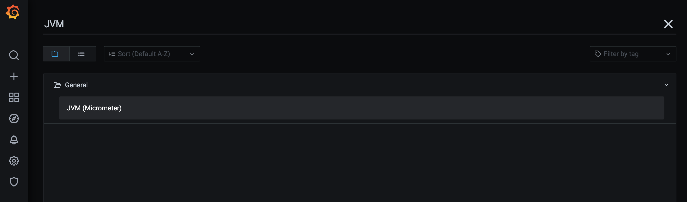

5. The dashboard looks something like this. Try changing the time duration from 24 hours to 15 mins or 30 mins.

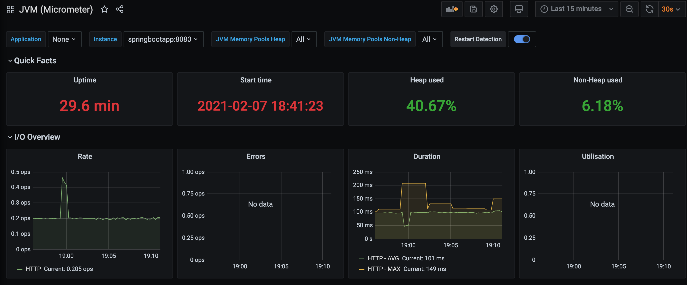

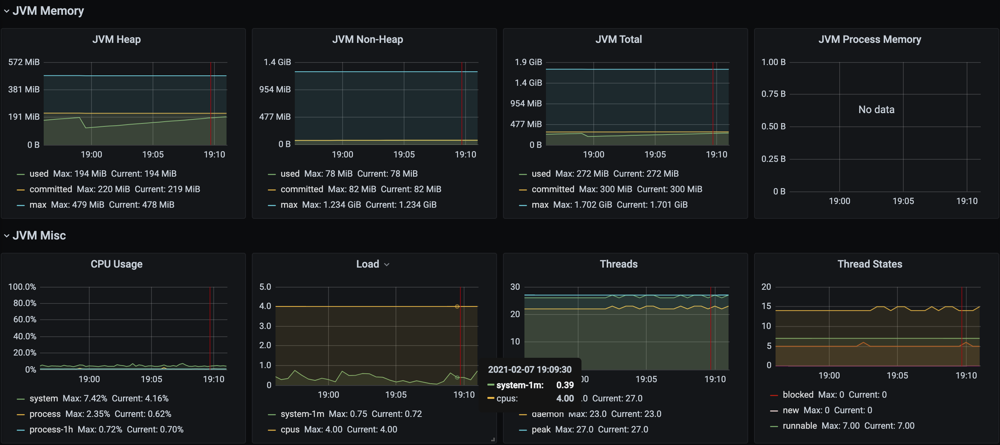

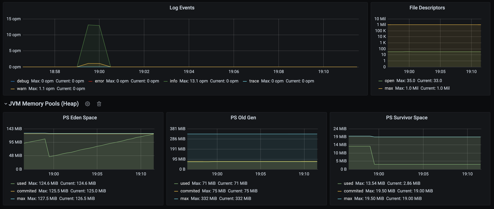

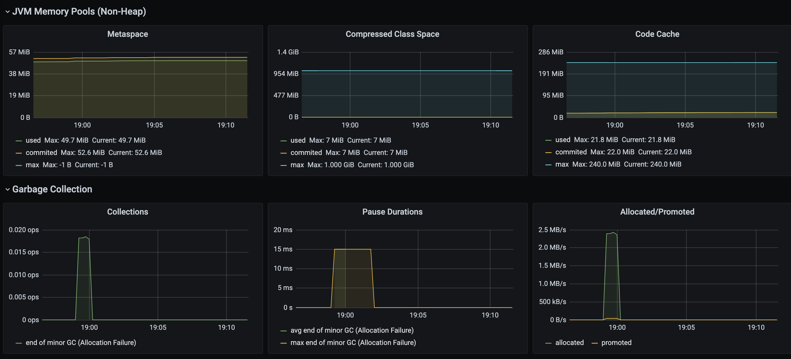

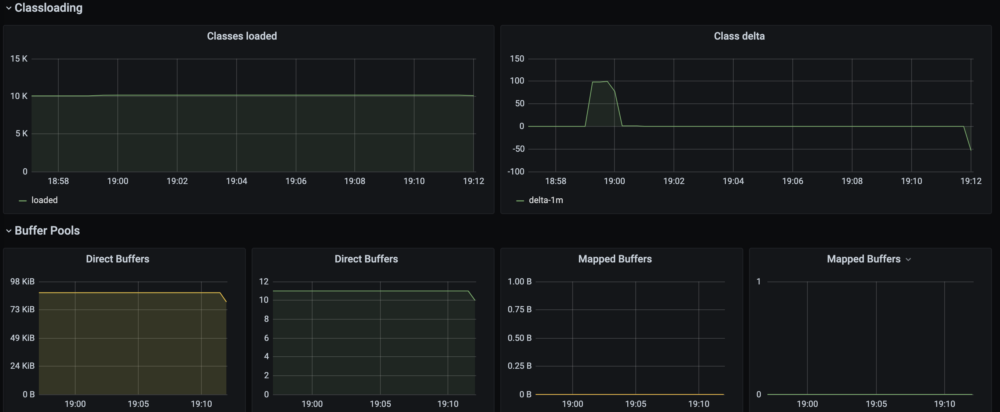
## ShutDown Instructions

**Stop & Delete the containers**

````
docker-compose -f docker-compose.yml down
docker system prune
````

**verify containers are stopped and deleted**

```
docker-compose -f docker-compose.yml ps
```
## Open Source Tools Used

* **Spring**
* **SpringBoot**
* **Swagger**
* **Docker**
* **Elastic Search**
* **LogStash**
* **Kibana**
* **Prometheus**
* **Grafana**

## References

* [Spring Boot Documentation](https://docs.spring.io/spring-boot/docs/current/reference/htmlsingle/)
* [Docker Documentation](https://docs.docker.com/)
* [Docker compose Documentation](https://docs.docker.com/compose/)  
* [Logstash Documentation](https://www.elastic.co/guide/en/logstash/6.8/index.html)
* [ElasticSearch Documentation](https://www.elastic.co/guide/en/elasticsearch/reference/6.8/index.html)
* [Kibana Documentation](https://www.elastic.co/guide/en/kibana/6.8/index.html)
* [Prometheus Documentation](https://prometheus.io/docs/introduction/overview/)
* [Grafana Documentation](https://grafana.com/docs/)
* [Swagger UI](https://swagger.io/tools/swagger-ui/)


**TIP:** You can use [Docker Desktop Mac](https://docs.docker.com/docker-for-mac/) or [Docker Desktop Windows](https://docs.docker.com/docker-for-windows/) to run application

